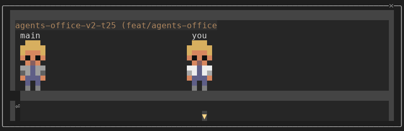
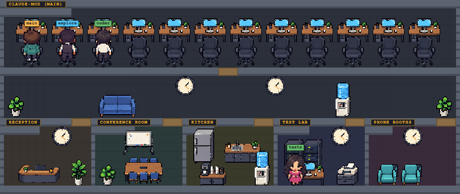
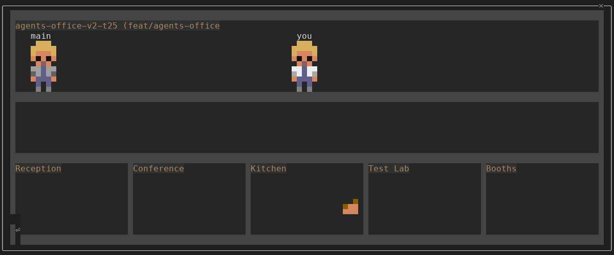

# claude-mod-agents-rpg

Agents Office is a Claude Code mod. It adds an `/office` command that opens a pane showing your Claude Code agents as small pixel people in an office. Every agent has hair, skin, a shirt in its model tier colour and trousers in its role colour. It sits at a desk while it reads or edits, walks between rooms when it calls other tools, and shows a speech bubble when agents message each other or finish.

You get a character of your own. With the pane focused, WASD walks it around, number keys emote, and other keys inspect an agent, peek at its messages, say a line, nudge it or interrupt the session.

In a terminal that draws images, the office is a pixel-art picture drawn by headless Chromium (see "Image office"). Elsewhere, and whenever Chromium is not available, the pane draws the same office as text figures.

Every Claude Code session on the machine can show up in the same office, one team room per session, read from small presence files (see "Shared office").



## Install

The mod folder is `.claude/skills/agents-office/` in this repo. There are two ways to load it.

**Project-local.** Start `claude` in this repo. The mod loads from the project skills folder as `agents-office@skills-dir`. If `/office` is not offered, run `claude plugin list` to check that it is loaded and enabled.

**User-wide.** From a checkout of this repo:

```
npm run install:user
```

This links `${CLAUDE_CONFIG_DIR:-$HOME/.claude}/skills/agents-office` to the mod folder of this checkout, so every Claude Code session loads the mod once, whatever its directory. The script refuses to replace a real directory, or a link to another checkout, unless you add `--force` (`npm run install:user -- --force`). Running it again on an already installed link changes nothing.

The script also runs `npm ci` when `node_modules/playwright` is missing and then `npx playwright install chromium`, which downloads about 150 MB of Chromium into the Playwright browser cache. The image office needs it. Add `--no-chromium` to skip the download (`npm run install:user -- --no-chromium`); the office then draws as text until you run `npm ci` (if `node_modules` is missing) and `npx playwright install chromium` yourself. A failed Chromium download exits 1 but keeps the link.

```
npm run uninstall:user
```

This removes the link, and only if it points at this checkout. It leaves a real directory or a link to another checkout in place. It does not touch the Chromium download; it prints where the browser cache is.

A project-local load (the first way) needs `npm ci` in the checkout and `npx playwright install chromium` for the image office; without them it draws the text office.

While you develop in a checkout, the user-wide link shadows that checkout's own project copy: the sessions run the linked checkout's files. Uninstall first (or point the link at the checkout you are editing) when you want a worktree's copy to be the one that loads.

## Use

- `/office` opens the pane. Nothing opens by itself. Running it again re-focuses the pad.
- `/office share all|anon|off` sets what this session publishes to the shared office (see "Shared office"). The choice is stored and kept between sessions; the default is `all`. Any other argument prints the usage line.
- `/office scene auto|image|text` sets how the office is drawn. The choice is stored and kept between sessions; the default is `auto`. `auto` draws the image office when the terminal can show images and Chromium works, and the text office otherwise. `image` skips the test image and starts Chromium at once (it still falls back to text when the surface has no `Image` element, when a blit is refused or when Chromium fails). `text` always draws the text office. `/office scene image` or `auto` also clears an earlier failure and tries again. Any other argument prints the usage line.

About one and a half seconds after the pane opens, a one-row input at its bottom-left takes the keyboard focus. That input is the pad: the keys below go to the office instead of the prompt.

## Image office

With `auto` or `image`, the pane shows one picture instead of text cells. A small node process (`renderer/render.mjs`) opens `renderer/office.html` in headless Chromium, draws the office from a scene description file that the mod rewrites when the scene changes (the renderer checks it every 50 ms), and saves each new frame as a PNG. The pane shows the newest PNG through the terminal's `Image` element. Rooms, desks, props and people are pixel-art sprites; the same rooms, motion, camera, pad keys, emotes, chat, inspect, shared sessions and status work as in the text office, so the "Controls", "Rooms" and "Shared office" sections apply to both.



- The picture is sized to the pane: 8 pixels per column and 17 per row, each side capped at 2048 pixels. Resizing the pane in either direction resizes the picture. Below 60x11 the pane shows the size line and the renderer pauses.
- People are drawn from 8 looks picked by a hash of the figure's key. The nameplate colour is the model tier. A seated agent shows its back at its desk. Figures stride while they move: the legs alternate in a procedural two-pose walk cycle (no walk art yet).
- Speech bubbles, emotes and chat lines are drawn above the figures. The inspect line, your chat draft and any fallback reason appear in a bar at the bottom of the picture.
- Load: the renderer draws at most 12 frames a second while something moves and no frame at all while nothing changes. Measured on one Mac at 120x40: about 6 to 11% of one core while idle and about 30% while walking (node plus Chromium).
- The scene description holds only what the text office shows (labels, rooms, poses, status, bubbles, chat). It sits in a private temp directory (mode 0700) that is deleted when the renderer exits. Nothing new is published to the presence files.
- Lifecycle: one renderer per session. It starts when the pane is drawn and stops when the pane closes, when the plugin reloads and when the session ends. If Claude Code is killed, the renderer notices within about 10 seconds and closes Chromium.

### Fallback to the text office

The pane draws the text office by itself when the cases below happen. It shows the reason in the pane for 8 seconds, adds it to the `/office` reply and adds it as a line to the office log:

- the terminal cannot draw the image. In `auto` the mod draws a small test image first. tmux answers that it cannot (Terminal.app is expected to, but that probe has not been run), and the reason is the terminal's own refusal text (inside tmux: "the Image draws its alt here: the terminal draws no placeholder images (env: inside tmux or screen)"). An ssh session can fail the same test, because the terminal cannot read the renderer's files;
- node is not found, Playwright is not installed, or Chromium is not installed (`npx playwright install chromium` fixes the last two);
- the renderer crashes three times within a minute. It restarts after 1 second and then 2 seconds before giving up. `/office scene auto` or `/office scene image` tries again.

In `auto`, Chromium is never started before the test image is accepted.

## Controls

These work once the pad has focus.

| Key | What it does |
| --- | --- |
| `W` `A` `S` `D` (either case) | Walk your character one tile. A tap moves exactly one tile; holding a key moves one tile per tick. Walls block you; agents do not. |
| `[` and `]` | Walk to the previous or next room, team rooms first and then the shared rooms, wrapping at both ends. |
| `1` `2` `3` `4` | Emote for 3 seconds: `!`, `?`, a heart and a note. The pane cannot draw the heart or the note glyph, so `3` shows a diamond and `4` shows `~`. |
| `e` | Use the nearest thing within reach: inspect an agent within 2 tiles (label, status, tool, room and elapsed time, shown for 6 seconds; your own session's agents only, with the last 60 characters of their latest text), or use the cat or a prop. See "Things to use". |
| `Shift+E` | Peek: opens a second pane with the last 10 text messages of the nearest agent of your own session, and switches to its tab. `Esc` returns to the Office pane. |
| `t` | Chat. What you type until Enter becomes a speech bubble of up to 40 characters above your character for 5 seconds. An empty line cancels. In chat mode every key, WASD and digits included, is text. |
| `m` | Nudge the nearest agent of your own session that is not main. A No/Yes dialog comes first; Yes sends the fixed text "Nudge from the office: please post a short status update." |
| `x` | Interrupt the main session's running turn, after a No/Yes dialog. |
| `Escape` | Returns focus to the prompt. It does not cancel a chat draft; send an empty line to do that. |

Inspect, peek and nudge only ever target agents of your own session, never a remote one. The whiteboard and the rack also show your own session only.

## Things to use

`e` uses one thing: the nearest one in reach. An own-session agent is in reach within 2 tiles. The cat and the props are in reach within 1 cell of your character's footprint. The smallest gap wins. On equal gaps an agent beats the cat and the cat beats a prop; between props the order is desk, whiteboard, coffee machine, sofa, water cooler, server rack, and then the one further left. A remote session's agent is never a target; its desk and props are.

| Thing | What `e` does |
| --- | --- |
| Agent | Inspect it, as described in "Controls". |
| Desk | In your own team room: opens a peek pane `Peek: <label>` with the last 10 text messages of the agent whose desk it is, when that agent is not itself the nearer target. An agent sitting at its desk is as near as the desk and wins the tie, so `e` inspects it instead; the peek comes up for an agent that is still walking to the desk. An empty desk says `Empty desk.`. Another session's desk says `<its name>'s desk` (`Session N` when it shares anonymously) and opens nothing. |
| Whiteboard | Opens a pane `Whiteboard` with your plan, at most 10 lines: `[x]` done, `[>]` in progress, `[ ]` to do, indented under their parent. It reads the todo-list mod's plan; when that mod is not loaded or has no plan yet, it mirrors the main session's own TodoWrite, TaskCreate and TaskUpdate calls (a subagent's calls are not shown). It redraws when the plan changes. `No plan yet.` when there is none. |
| Server rack | Opens a pane `Server rack` with the context fill, the cost, how many agents are running and idle, then each of your own agents with the name of its current tool. A value that has not been reported yet (before the first response) shows `-`. It is a snapshot of your own session taken when you press `e`; it does not refresh. Remote agents and tool arguments never appear. |
| Coffee machine | Your character holds a mug for 8 seconds. |
| Sofa | Your character sits on it until you press a movement key (`W` `A` `S` `D`), `[` or `]`. |
| Water cooler | A fixed line (one of 8) shows as a speech bubble over your character for 5 seconds. It is an ordinary chat bubble, so other sessions see it like one you typed. |
| Cat | A heart shows over the cat for 3 seconds. |

While something is in reach, a hint names it: `e: coffee machine`, `e: inspect <label>`, `e: pet the cat`. It disappears when you walk away. When several lines compete, your chat draft is shown first, then an inspect or action line, then the hint.

While a peek pane is shown (`Shift+E`, or `e` at a desk, the whiteboard or the rack), the pane switches to it at once (its tab sits before `Office`, for example `Whiteboard | Office`) and the keys belong to it, so `W` `A` `S` `D` do nothing. Press `Esc` to go back to the Office pane; the keys return to it and `W` `A` `S` `D` move your character again.

Text office limits: it draws no mug, no sitting pose and no heart. Instead a line appears: `You hold a mug of coffee.` (8 seconds), `You sit on the sofa.` (6 seconds, although you stay seated until you move) and `You pet the cat.` (3 seconds). The hint is drawn on the overlay row of the map; when the pane has a log strip it replaces the strip's newest row while it shows. The peek panes open (as a tab, shown at once) only when `e` or `Shift+E` is pressed, never by themselves, and none of them refresh except the whiteboard.

## Rooms

Every office has one team room per session, a corridor and five shared rooms.

| Room | What happens there |
| --- | --- |
| Team room, labelled `project (branch)` | One per Claude Code session, holding its main agent and subagents. Agents sit here at their own desk while they read or edit. The label is the directory name and the git branch, and the branch is dropped when there is none. Sessions with the same label get ` 2`, ` 3`. |
| Reception | Spawned agents walk in at its door. Agent and TaskStop calls send an agent here, and finished agents report here. |
| Conference | A SendMessage between two known agents brings both here. |
| Kitchen | A finished agent goes here after its report and leaves 5 seconds or more after it finished. |
| Test Lab | Bash, BashOutput, KillShell, Monitor. |
| Booths | WebSearch, WebFetch, and MCP tools whose name contains fetch, http or search. |

The tool an agent just called decides its room (`hooks/activity.ts`):

- Read, Grep, Glob, NotebookRead, LSP, ReadMcpResourceTool, ListMcpResourcesTool and ReadMcpResourceDirTool: the agent's own desk, in a reading pose.
- Edit, Write, MultiEdit, NotebookEdit and any tool not listed (including MCP tools that are not network tools): the agent's own desk, in a typing pose.

Code search that runs through Bash shows in the Test Lab, not at a desk, because the office sees only the tool name.

## Tiers and roles

The shirt colour is the model tier: the first of haiku, sonnet, opus, fable found in the model alias given at spawn, otherwise in the resolved model id.

| Tier | Shirt |
| --- | --- |
| haiku | `#4fc3f7` |
| sonnet | `#66bb6a` |
| opus | `#ffb74d` |
| fable | `#ba68c8` |
| grey | `#9e9e9e` |

Grey means the model is unknown. It is used for the main session and for teammates that were only seen in `agent.list` and never spawned through the hook. Your own character wears a white shirt and the plate "you".

The trouser colour is the role:

| Role | Trousers | Who |
| --- | --- | --- |
| lead | `#546e7a` | The main session. |
| dev | `#2f4a7a` | Any subagent that is not a reviewer or researcher, and any agent with no role. |
| research | `#7a6a4f` | A subagent type containing explore, research or search. |
| review | `#5e3a6e` | A subagent type containing review. |

Hair and skin tones come from a hash of the agent's id, so an agent keeps its look.

## What you will see

- Spawn: a new agent appears at the Reception door and walks to a desk in its team room.
- Work: the agent walks to the room its latest tool call names (see "Rooms") and stands there in a working pose; at a desk it sits.
- Messaging: when an agent calls SendMessage to another known agent, both walk to the Conference room. The sender shows a speech bubble with the first 40 characters of the message for 4 seconds, then both return to what they were doing.
- Completion: a subagent that finishes its turn walks to Reception and shows "done" (or "stopped" if the turn did not end with an answer). Its parent, or the main session, shows "got it". It then walks to the Kitchen and leaves once at least 5 seconds have passed since it finished.
- Log: the map comes first; a pane with more than 23 body rows shows up to five lines under it with the newest events (arrivals at a room, messages, reports), oldest first.
- Cat: a cat wanders the shared rooms and rests 5 to 15 seconds between walks. It is only drawn in your own pane; it is not published.
- Night: from 20:00 to 06:00 by your machine's clock, the floors, walls, doors and signs are 35% darker. Figures keep their colours.

## Figure sizes and the camera

- At every pane size the office draws (60 columns and 11 rows or more), a standing person is 5x5 cells, and a person at a desk takes 8x5 cells (the person plus the monitor). Their plate shows the label, cut to 7 characters.
- A pane narrower or shorter than the 5x5 map (which is at least 71 columns by 23 rows) crops it with the camera below; there is no smaller layout.
- A map larger than the pane is cropped around your character (or around your own team room when your character is not drawn). Arrows at the pane edges show where more office is hidden: `▲` and `▼` at the middle column of the first and last row, `◀` and `▶` on the first visible corridor row. `^` and `v` replace the vertical marks where the terminal cannot draw triangles.
- At 80x24 the pane body is 76 columns by 11 rows, so you see one room band at a time and `[` `]` or WASD scroll the view. At 120x40 the whole office fits in the pane and no `▲` or `▼` shows.



## Shared office

Each Claude Code session writes one small JSON file, and every pane reads the files of the others, so all your sessions show the same rooms and the same people.

- The directory is `$CLAUDE_CONFIG_DIR/agents-office/presence`, or `$HOME/.claude/agents-office/presence` when that variable is empty. Each session writes only `<sessionId>.json` there.
- Cadence: once a second the mod writes when the record changed and otherwise refreshes it every 3 seconds. A session whose heartbeat is older than 10 seconds drops out of the office. At start-up files not modified for 24 hours are deleted. A pane shows at most 16 other sessions.
- Published: a format version, the session id, the start time and heartbeat time, the share mode, the team label and branch, and for each agent (main plus the newest, at most 32, and the record is at most 8 KB) its id, label, tier, role, room, pose, status and parent id. For your own character it publishes the room and position inside it, its facing and, while they show, the emote and any chat line you typed on purpose.
- Never published: prompts, file paths, tool names or arguments, SendMessage text and transcripts. The one free text is the chat line you type with `t`.
- `/office share anon` publishes the role as every agent's label and blanks the team label and branch. Other panes show such a session as `Session N`, where N is its position in the room order. Your own pane still shows your own names.
- `/office share off` writes one "gone" record, then stops writing and stops reading: you see only your own session.
- Room order is by start time, then session id. Each pane lays the rooms out for its own size and animates the people locally from presence data that updates about once a second, so panes are not pixel-identical and a remote character's position is approximate.

## Requirements

- Claude Code 2.1.289, the version the API types were taken from (see `CLAUDE.md`).
- The terminal surface only. Other surfaces show "Office needs the terminal surface."
- For the image office: node 20 or later, about 150 MB of disk for Chromium, and a terminal that draws images. Ghostty is verified by the owner (the image draws, and a height-only resize re-renders the pane). kitty is expected to work from the Claude Code API docs and is not tested here. WezTerm and iTerm2 are untested. tmux, Terminal.app and ssh fall back to the text office; without any of this the text office needs nothing extra.
- A pane body of at least 60 columns by 11 rows. Inline, that means a terminal of about 64x24; the office fits 80x24 with no log there. `/office` requests a pane of up to 23 rows. A smaller pane shows a line naming the needed and actual size ("Office needs a 60x11 pane, this one is ...") and draws nothing else. Resizing to a valid size redraws at once.

## Known limits

- tmux and Terminal.app cannot draw the image office and ssh may not; they get the text office with the reason shown (see "Fallback to the text office"). The Terminal.app probe has not been run, so that is from the design, not a measurement.
- In the image office, the walk cycle is procedural (legs only, no walk art), and the cat and any other pets have no collision with props or people.
- A pane resize in height alone re-draws the pane in Ghostty and tmux, although the Claude Code API docs say it does not. If a future build follows the docs, the picture would keep its old height until the next width change or redraw.
- Image office: a remote figure is placed from presence data, so mixed pane sizes across sessions place figures approximately, like in the text office.
- Panes are not pixel-identical, and a remote figure's position is approximate when the two panes have different sizes (see "Shared office").
- The pad takes focus 1.5 seconds after the pane opens, so keys pressed earlier go to the prompt.
- The peek pane is a snapshot taken when you press `Shift+E`; it does not refresh and opens as a second tab that is shown at once. The full transcript view cannot be opened from the office.
- Teammates have no tier colour and show grey.
- A subagent's `agentId` on `tool.call` was observed through a test cast only (the typed test API drops it). Whether a real session delivers it the same way is not confirmed.
- The cat walks through people and is drawn under them (the same in the image office).
- The night tint uses the machine's local time zone.
- Not covered: Windows, `/office` in a `/tmp` session (login wizard), and a relative `CLAUDE_CONFIG_DIR` (the user-wide link target is absolute; the link path is used as given).
- At the narrowest layouts a bottom-room sign can be cut short, for example `Conferenc`.

## Develop

- `npm ci`, then `npx playwright install chromium` (needed by the image office and `smoke:renderer`), then `npm run check`. It runs `validate` (`claude plugin validate`), `typecheck` (`tsc -p tsconfig.json`) and `test` (`claude plugin test`). Validate and test need the `claude` CLI and run locally only. CI runs typecheck only.
- Mod path: `.claude/skills/agents-office/` (manifest `.claude-plugin/plugin.json`, hooks in `hooks/`, state contract in `types/index.d.ts`). The design notes are in `docs/agents-office/plan.md`; the v2 plan and decisions are in `docs/agents-office-v2/TODO.md`.
- `npm run smoke:renderer` starts the renderer on a fixture, checks that the PNG has the fixture's size, and tests frame pacing, the stale-heartbeat exit, the missing-Chromium error and the temp-dir sweep. It needs Chromium, so it runs locally only. With a path argument it renders that scene file: `npm run smoke:renderer -- scripts/fixtures/state-busy.json`; set `SMOKE_FRAME_OUT=<file.png>` to keep the frame. The `docs/images/office-image-120x40.png` picture is such a frame, from real `sceneOf` output for a 928x391 box.
- `npm run sprites` re-cuts the 82 sprites and `atlas.json` from the raw sheets in `assets/sprites/raw/` (a re-run changes no file). `npm run sprites:check` verifies that `atlas.json` and `hooks/sceneArt.ts` list the same sprite names; `npm run sprites:table` regenerates `renderer/sprite-table.json`, which `smoke:renderer` checks.
- The v3 plan and decisions are in `docs/agents-office-v3/TODO.md`.
- Hot reload: saving a file in the mod reloads the module in a running session. The office keeps its agents, because state lives in `$.state` atoms and not in module variables.
- Debug lines in the Claude Code debug log start with `agents-office:`. A line containing `threw` or `refused` is a failure.
